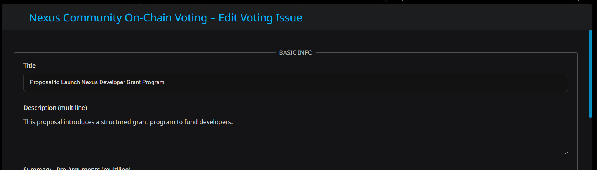

# Nexus Community Voting Module - User Guide

Welcome to the Nexus Community Voting Module --- a secure, on-chain voting tool integrated with your Nexus desktop wallet. This guide will walk you through installation, usage, and what to expect.

## 📦 Installation

1.  Open the Nexus Interface (desktop wallet)
2.  Go to *Settings \> Modules*
3.  Drag and drop the ZIP archive for this module onto the Modules page
4.  Restart the wallet if prompted

> ✅ Your signature chain requires a sufficient trust score create new voting issues (currently: 500000).  When voting issues are being created you can set the minimum trust score required to vote on that issue (default: 10000).

## 🗳 Browsing and Participating in Votes

Once installed, open the **Voting** tab in the Nexus wallet. There, you can:

### 🔍 View Open Voting Issues

- See a list of voting issues showing
  -  creation date
  - deadline when the voting ends
  - the title and all of the optins for the issue
  - the number of votes cast for the issue as well as for each option
  - the weighted vote score for each each option
  - the per-option percent of weighted vote score (so you can easily tell which option is winning)
- The list can be sorted in ascending or descending order by by creation date, title, or deadline and filtered by all, active, closed, or just the issues you submitted
- The list can be set to display 3, 5, 10, 25, or 50 issues per page
- Voting issues can also be searched by any word in the title by clicking the binoculars icon (currently search is case-sensitive)
- For each issue, you can click a button to display a screen showing all of the issue details and providing the options for actually casting your vote
- If you were the author of the issue, a button is available to bring you to a screen where you can edit the voting issue configuration (Note: voting options cannot be changed yet.)
- The top-right refresh icon reloads the list of voting issues
- The top-right document icon loads this User Guide
- You can subscribe to/unsubscribe from announcements that will be sent by email when new voting issues are entered
- The system automatically sends a similar announcement to the Nexus Community - General channel in Telegram
- This page also shows your current trust score and voting power (weighted vote score which is your trust score multiplied by the amount of NXS you are staking)
- Also shown on this page is the number of times total you've voted across all voting issues (for issues where you are allowed to change your vote, only your last vote is counted)

### 🔍 View Details for an Individual Voting Issue

- See the title, description, organizer, email address, and Telegram handle
- Read summaries of each position (Pro and Con)
- See the deadline, trust level to participate in the voting on this issue, and finality setting
- Review possible outcomes
- View supporting documents (text or Markdown) inline with syntax highlighting and lazy-loaded images
- Download supporting documents (text, Markdown, PDF, or Word)
- On-chain addresses for the issue and each voting option are displayed for anyone to be able to verify the results; clicking on the voting account name or address copies it to the clipboard

### ✅ Cast Your Vote

1.  Click the voting option button to place your vote
2.  You'll be prompted to enter your PIN
3.  Your vote sends 0.000001 NXS from your "default" account to the associated option account on-chain
4.  The transaction's reference field includes your weighted vote amount based on your trust and stake
5.  An indicator reveals which voting option you voted on
6.  If an issue does not allow changing your vote, the option buttons will be disabled once you've voted
7.  If an issue does allow changing your vote, only the last vote for your signature chain will be counted
7.  A subsequent version of the backend processing will return your voting NXS once the deadline for the voting has been reached

> 💡 Your vote is recorded as a Nexus CREDIT transaction from your sigchain, with your weight calculated as *(trust + stake/1,000,000)*

### 🔒 Finality Options

- *****one_time*****: You can vote only once
- *****changeable*****: You may change your vote once --- only the **most recent valid vote** from your sigchain is counted

## 🧾 Submitting Voting Issues *(Admin Only)*

![Entering/Editing Voting Issues - #1]https://raw.githubusercontent.com/NealHelman/nexus-voting-module/main/user_guide/screenshots/Enter-New-Voting-Issue-Top.jpg)

If your trust level meets the configured threshold, you'll be able to access an **Admin** screen where you can:

- Create a new voting issue

- Enter metadata: title, description, pro/con summaries, outcomes,
  deadline, etc.

  - Minimum trust score required to vote defaults to 10000
  - Deadline defaults to 30 days in the future

- Upload supporting documents (text, Markdown, PDF, or Word) to the voting authority server

- Submit the voting issue with a PIN prompt --- this sends NXS to the backend Voting Authority to fund asset and account creation

- Documents can be deleted before submission if desired

> ⛽ Cost: 2 NXS for the vote asset + 1 NXS per named voting option account

## 📊 Vote Counting and Security

- Vote counts are weighted sums based on each voter's trust and stake
- Tallying reads the *contracts.reference* from each debit transaction to retrieve vote weights
- Only the most recent valid vote per sigchain is included in the total
- Votes are pseudonymous: they are public on-chain but tied to a sigchain hash, not your name

> 🔐 The module does not store or expose personal data

## 📢 Announcements and Subscriptions

You can subscribe to be notified of new voting issues via:

- **Email:** A prompt in the Voting tab allows you to subscribe/unsubscribe using your email address and PIN. Emails are sent from *announcement@nexus-voting.com*.
- **Telegram:** New voting issues are optionally announced in a Nexus Community -General Telegram channel.

## ❓ FAQ

**Q: Can I see who voted for what?**\
A: No. Voter identities are not shown, only aggregate weighted vote counts.

**Q: Can I change my vote?**\
A: Only if the vote's finality setting is *changeable*

**Q: Where are my votes stored?**\
A: On-chain in the Nexus ledger --- each vote is a 0.000001 NXS CREDIT to the option account

**Q: Are vote weights public?**\
A: Yes. They are derived from public trust and stake metrics stored in your trust account.  In addition, your weight score at the time you cast a vote is recorded in the Reference field on the vote DEBIT transaction.

## 📬 Support and Feedback

- Please report bugs at the module's GitHub repository: https://github.com/NealHelman/nexus-voting-module/issues
- If you need help, contact the module author at neal.helman@nexus.io or submit feedback through the official Nexus community channels

Enjoy shaping the future of Nexus --- democratically and securely!
